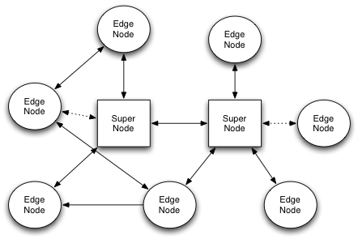

# n2n
n2n





## deploy server 
```
kubectl apply -f n2n-server.yaml
kubectl get pods -o wide
```

```go to server and start the server 
supernode -l 1024 -f  ```


## deploy client


```
kubectl apply -f n2n.yaml
kubectl get pods -o wide

```

```
start the client on each 
edge -d n2n0 -a <POD IP> -c mypbxnet -k mypass -l <supernode_host>:<port>
```